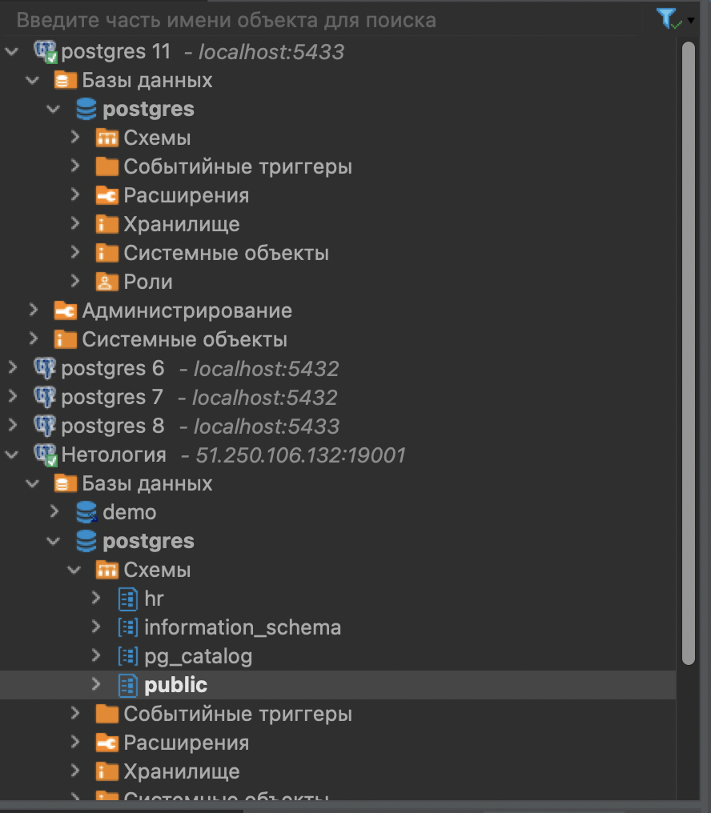

<h1> Домашняя работа 1 </h1>
<h2> Задание 1 </h2>
  
Создайте новое соединение в DBeaver и подключите облачную базу данных с учебной базой данных dvd-rental согласно инструкции. Сделайте скриншот результата. 

    
<h2> Задание 2 </h2>
  
 Откройте ER-диаграмму таблиц учебной базы данных dvd-rental. Сделайте скриншот результата. 

  
<h2> Задание 3</h2>
  
 Перечислите все таблицы учебной базы данных dvd-rental и столбцы, которые имеют ограничения первичных ключей для этих таблиц. Запишите решение в формате таблицы: letsdocode.ru...in/1-3.png 

  
 Увидела ошибку с film_actor и film_category 

  <table>
    <tr>
        <td>название таблицы</td>
        <td>поле таблицы, которое является первичным ключом</td>
    </tr>
    <tr>
        <td>category</td>
        <td>category_id</td>
    </tr>
    <tr>
        <td>actor</td>
        <td>actor_id</td>
    </tr>
    <tr>
        <td>address</td>
        <td>address_id</td>
    </tr>
    <tr>
        <td>country</td>
        <td>country_id</td>
    </tr>
    <tr>
        <td>film_actor</td>
        <td>film_actor_id</td>
    </tr>
    <tr>
        <td>inventory</td>
        <td>inventory_id</td>
    </tr>
    <tr>
        <td>city</td>
        <td>city_id</td>
    </tr>
    <tr>
        <td>rental</td>
        <td>rental_id</td>
    </tr>
    <tr>
        <td>payment</td>
        <td>payment_id</td>
    </tr>
    <tr>
        <td>language</td>
        <td>language_id</td>
    </tr>
    <tr>
        <td>film_actor</td>
        <td>film_id и actor_if</td>
    </tr>
    <tr>
        <td>film</td>
        <td>film_id</td>
    </tr>
    <tr>
        <td>staff</td>
        <td>staff_id</td>
    </tr>
    <tr>
        <td>store</td>
        <td>store_id</td>
    </tr>
    <tr>
        <td>film_category</td>
        <td>film_id и category_id</td>
    </tr>

</table>
<h2> Задание 4 </h2>
  
 Выполните SQL-запрос к учебной базе данных dvd-rental “SELECT * FROM country;”. Сделайте скриншот результата. 

 

 <h1> Дополнительное задание</h1>
  <h2> Задание 1 </h2>
  
 Установите локальный сервер PostgreSQL, восстановите учебные данные согласно инструкции и повторите задания 2–4 из основной части домашнего задания на локальной базе данных. Сделайте все необходимые скриншоты. Если вы изначально установили локальный сервер, то можете сразу приступать к следующему заданию. 

  
 Вроде бы из скриншотов выше видно, что я изначально установила локальный сервер.
  На всякий случай прикладываю наличие локалки

  

  <h2> Задание 2 </h2>
  
 С помощью SQL-запроса выведите в результат таблицу, содержащую названия таблиц и названия ограничений первичных ключей в этих таблицах. Для написания запроса используйте представление information_schema.table_constraints.

 

  
  <code>
    SELECT table_name, constraint_name FROM information_schema.table_constraints WHERE constraint_type = 'PRIMARY KEY' AND table_schema = 'public';
  </code>

  
